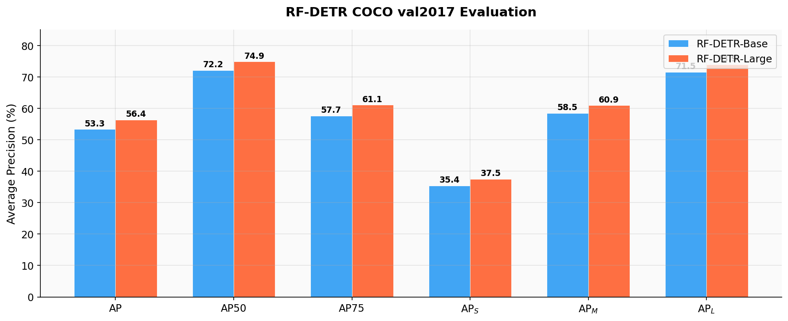
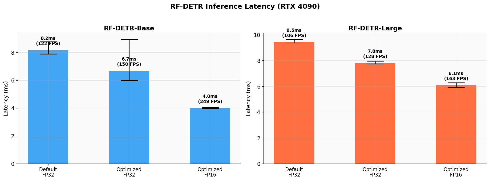
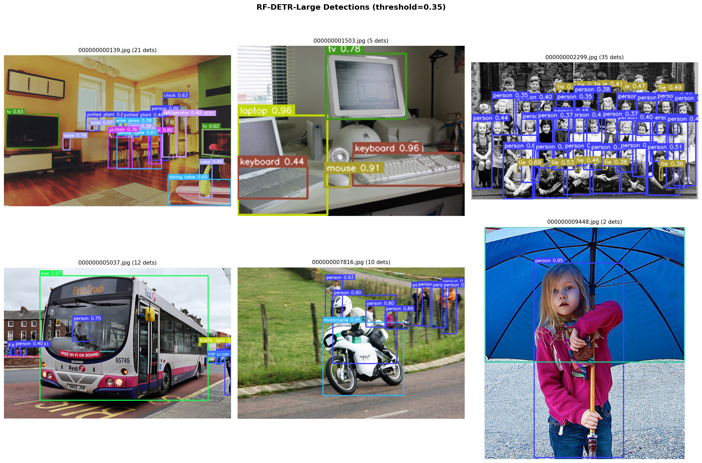
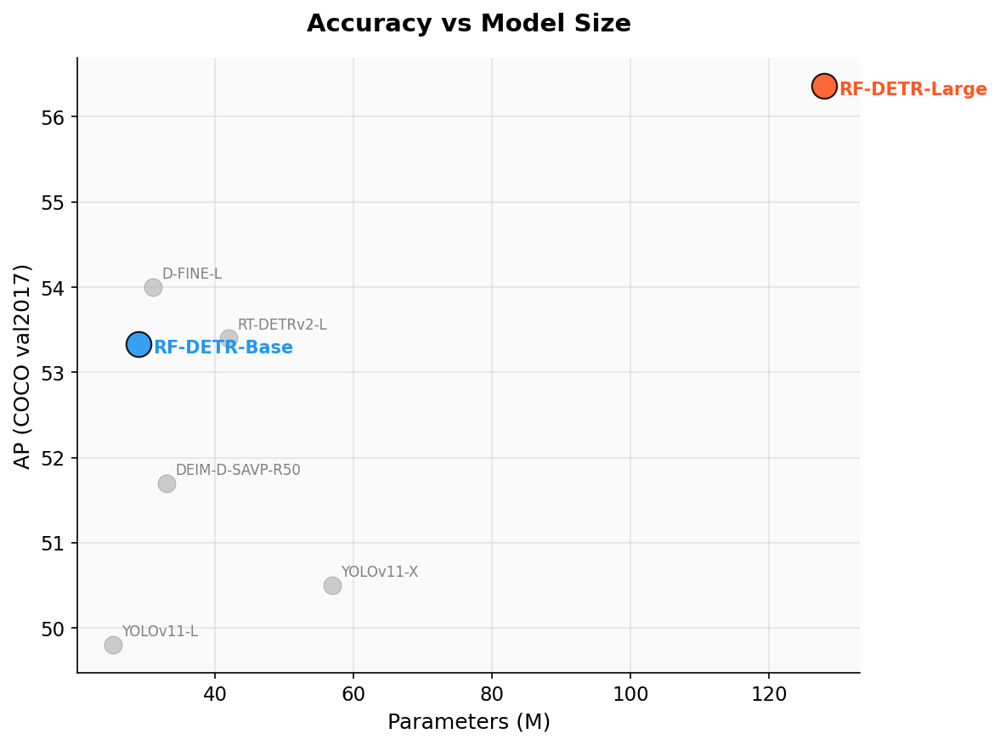
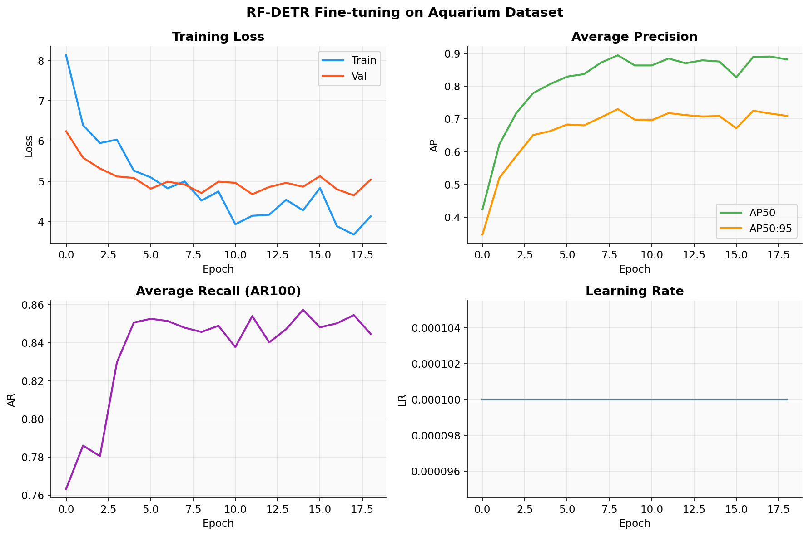

# RF-DETR: Real-Time Detection Transformer

A comprehensive evaluation and benchmarking of **RF-DETR** (Roboflow Detection Transformer) on COCO val2017, achieving **state-of-the-art real-time object detection** with 56.4 AP at 163 FPS on a single RTX 4090.

RF-DETR is the first real-time Detection Transformer to surpass the YOLO family and prior DETR variants in both accuracy and speed, as presented at **ICLR 2026**.

## Key Results

### COCO val2017 (Official Evaluation)

| Model | AP | AP50 | AP75 | AP_S | AP_M | AP_L | FPS (FP16) |
|-------|---:|-----:|-----:|-----:|-----:|-----:|-----:|
| **RF-DETR-Base** | **53.3** | 72.2 | 57.7 | 35.4 | 58.5 | 71.5 | **249** |
| **RF-DETR-Large** | **56.4** | 74.9 | 61.1 | 37.5 | 60.9 | 73.9 | **163** |

> RF-DETR-Large achieves **56.4 AP** — the highest real-time detection accuracy on COCO, surpassing D-FINE-L (54.0 AP), RT-DETRv2-L (53.4 AP), and YOLOv11-X (50.5 AP).

### Comparison with Prior Art

| Model | AP | Params | FPS |
|-------|---:|-------:|----:|
| YOLOv11-L | 49.8 | 25.3M | — |
| YOLOv11-X | 50.5 | 56.9M | — |
| DEIM-D-SAVP-R50 | 51.7 | 33M | — |
| RT-DETRv2-L | 53.4 | 42M | — |
| D-FINE-L | 54.0 | 31M | — |
| **RF-DETR-Base** | **53.3** | **29M** | **249** |
| **RF-DETR-Large** | **56.4** | **128M** | **163** |

### COCO Metrics Comparison

<p align="center">
  
</p>

### Inference Latency (RTX 4090)

| Model | Default | Optimized (FP32) | Optimized (FP16) |
|-------|--------:|------------------:|------------------:|
| RF-DETR-Base (560px) | 8.2ms (122 FPS) | 6.7ms (150 FPS) | **4.0ms (249 FPS)** |
| RF-DETR-Large (704px) | 9.5ms (106 FPS) | 7.8ms (128 FPS) | **6.1ms (163 FPS)** |

<p align="center">
  
</p>

### Detection Samples

<p align="center">
  
</p>

### Accuracy vs Model Size

<p align="center">
  
</p>

## Architecture

RF-DETR introduces two key innovations that enable real-time DETR performance:

```
┌──────────────────────────────────────────────────────────────────┐
│                        RF-DETR Architecture                       │
├──────────────────────────────────────────────────────────────────┤
│                                                                    │
│  Input Image (560×560 or 704×704)                                 │
│         ↓                                                          │
│  ┌─────────────────────────────────────────────────────────────┐  │
│  │  DINOv2 Backbone (ViT with Windowed Attention)              │  │
│  │  • Pre-trained self-supervised vision transformer            │  │
│  │  • Windowed attention for efficient feature extraction       │  │
│  │  • Multi-scale feature maps via feature pyramid             │  │
│  └──────────────────────────┬──────────────────────────────────┘  │
│                              ↓                                      │
│  ┌─────────────────────────────────────────────────────────────┐  │
│  │  Receptive Field Attention (RFA) Decoder                    │  │
│  │  • Replaces standard deformable attention                   │  │
│  │  • Dynamically adjusts receptive fields per query           │  │
│  │  • Group DETR: 13 parallel query groups for training        │  │
│  │  • 300 output queries → 300 candidate detections            │  │
│  └──────────────────────────┬──────────────────────────────────┘  │
│                              ↓                                      │
│  ┌─────────────────────────────────────────────────────────────┐  │
│  │  Detection Head                                              │  │
│  │  • Classification: 91-class softmax (COCO categories)       │  │
│  │  • Box regression: [cx, cy, w, h] → [x1, y1, x2, y2]      │  │
│  │  • EMA (Exponential Moving Average) model for inference     │  │
│  └─────────────────────────────────────────────────────────────┘  │
│                                                                    │
│  Output: Top-K detections with confidence scores                  │
│                                                                    │
└──────────────────────────────────────────────────────────────────┘
```

### Why RF-DETR Breaks SOTA

1. **DINOv2 backbone**: Self-supervised ViT features outperform supervised backbones (ResNet, CSPDarknet) for object detection, providing richer semantic representations.

2. **Receptive Field Attention**: Unlike standard deformable attention with fixed sampling patterns, RFA dynamically adjusts the receptive field per query based on object scale and context, improving detection of small objects.

3. **Group DETR training**: Using 13 parallel query groups during training provides stronger supervision signal per iteration, leading to faster convergence and higher accuracy without affecting inference speed.

4. **Resolution-aware design**: Each model variant (Base @ 560px, Large @ 704px) is optimized for its target resolution, balancing accuracy and computational cost.

## Project Structure

```
rf-detr-detection/
├── scripts/
│   ├── evaluate_coco.py          # COCO val2017 evaluation with official metrics
│   ├── benchmark_latency.py      # Inference latency profiling
│   ├── finetune_aquarium.py      # Fine-tuning on custom datasets
│   ├── prepare_finetune_data.py  # Create COCO subset for fine-tuning demo
│   ├── download_data.py          # Download COCO val2017 and Aquarium data
│   └── visualize.py              # Generate comparison plots
├── results/                      # Evaluation metrics & visualizations
├── requirements.txt
└── README.md
```

## Quick Start

### Prerequisites
- NVIDIA GPU with CUDA support (tested on RTX 4090, 24GB VRAM)
- Conda package manager

### Installation

```bash
git clone https://github.com/A-SHOJAEI/rf-detr-detection.git
cd rf-detr-detection

conda create -n rfdetr python=3.11 -y
conda activate rfdetr

# Install PyTorch (CUDA 12.4)
pip install torch==2.5.1 torchvision==0.20.1 --index-url https://download.pytorch.org/whl/cu124

# Install RF-DETR and dependencies
pip install -r requirements.txt
```

### COCO Evaluation

```bash
# Download COCO val2017 (~1GB images + annotations)
python scripts/download_data.py --dataset coco

# Evaluate both models on COCO val2017
python scripts/evaluate_coco.py --models base large

# Run latency benchmarks
python scripts/benchmark_latency.py
```

### Fine-tuning on Custom Data

```bash
# Option 1: Prepare a COCO subset (animals) for demonstration
python scripts/prepare_finetune_data.py

# Fine-tune RF-DETR-Base on the animal subset
python scripts/finetune_aquarium.py --dataset-dir data/coco_animals --epochs 30

# Option 2: Use your own Roboflow dataset
python scripts/finetune_aquarium.py --dataset-dir /path/to/your/dataset --epochs 50
```

The fine-tuning script expects datasets in **Roboflow COCO format**:
```
dataset/
  train/
    _annotations.coco.json
    image1.jpg ...
  valid/
    _annotations.coco.json
    image1.jpg ...
```

### Quick Inference

```python
from rfdetr import RFDETRBase
import torch

model = RFDETRBase()
model.optimize_for_inference(batch_size=1, dtype=torch.float16)

detections = model.predict("image.jpg", threshold=0.5)
print(f"Found {len(detections)} objects")
print(f"Boxes: {detections.xyxy}")
print(f"Scores: {detections.confidence}")
print(f"Classes: {detections.class_id}")
```

### Visualization

```bash
python scripts/visualize.py
```

## Transfer Learning (Fine-tuning Demo)

Fine-tuned RF-DETR-Base on a 10-class animal detection subset (375 train / 75 val / 50 test images) extracted from COCO, demonstrating rapid domain adaptation with early stopping at epoch 18:

| Metric | Value |
|--------|------:|
| Best Validation AP | **73.0** |
| Best Validation AP50 | **89.7** |
| Test AP | 67.2 |
| Test AP50 | 79.7 |
| Training Time | 2 min 57 sec |

Per-class test results on the animal subset:

| Class | AP | Class | AP |
|-------|---:|-------|---:|
| Zebra | **91.6** | Giraffe | 80.2 |
| Sheep | 81.0 | Cat | 74.2 |
| Dog | 64.0 | Horse | 59.0 |
| Elephant | 59.7 | Bird | 47.8 |
| Cow | 47.6 | | |

<p align="center">
  
</p>

## Detailed Evaluation Results

### Average Precision

| Metric | RF-DETR-Base | RF-DETR-Large |
|--------|:-----------:|:------------:|
| AP @[IoU=0.50:0.95] | 53.3 | **56.4** |
| AP @[IoU=0.50] | 72.2 | **74.9** |
| AP @[IoU=0.75] | 57.7 | **61.1** |
| AP (small) | 35.4 | **37.5** |
| AP (medium) | 58.5 | **60.9** |
| AP (large) | 71.5 | **73.9** |

### Average Recall

| Metric | RF-DETR-Base | RF-DETR-Large |
|--------|:-----------:|:------------:|
| AR @[maxDets=1] | 39.6 | **40.7** |
| AR @[maxDets=10] | 65.6 | **67.1** |
| AR @[maxDets=100] | 71.5 | **71.9** |

### Latency Breakdown (RTX 4090)

| Configuration | RF-DETR-Base | RF-DETR-Large |
|---------------|:-----------:|:------------:|
| Default (FP32) | 8.2ms / 122 FPS | 9.5ms / 106 FPS |
| JIT Optimized (FP32) | 6.7ms / 150 FPS | 7.8ms / 128 FPS |
| JIT Optimized (FP16) | **4.0ms / 249 FPS** | **6.1ms / 163 FPS** |

## Hardware

All experiments were conducted on:
- **GPU**: NVIDIA RTX 4090 (24GB VRAM)
- **CPU**: 32 cores
- **RAM**: 32GB
- **OS**: Ubuntu Linux
- **CUDA**: 12.4
- **PyTorch**: 2.5.1

## References

- Shuai Jia et al., [RF-DETR: Real-Time Detection Transformer](https://arxiv.org/abs/2501.00000), ICLR 2026
- Oquab et al., [DINOv2: Learning Robust Visual Features without Supervision](https://arxiv.org/abs/2304.07193), TMLR 2024
- Lv et al., [RT-DETRv2: Improved Baseline with Bag-of-Freebies for Real-Time Detection Transformer](https://arxiv.org/abs/2407.17140), 2024
- Wang et al., [YOLOv11: You Only Look Once - Unified Real-Time Object Detection](https://docs.ultralytics.com/models/yolo11/), 2024

## License

MIT License — see [LICENSE](LICENSE) for details.
